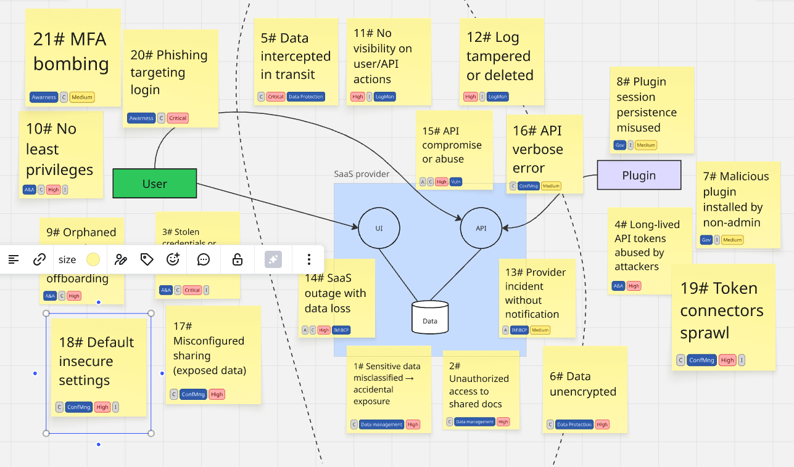

# Simple framework to integrate threat modeling into Agile
AKA a ethnographic approach to security development

## Why
Bringing threat modeling into Agile using attacker-based user stories can make security risks more visible and manageable during development
## How
You're essentially flipping traditional user stories to write abuser stories or threat stories, which describe how an attacker might exploit weaknesses. These stories can then be addressed like any other backlog item.

## Follows a framework we can use
#### 🧠 Structure of an Attacker Story

    As an attacker, I want to [action/technique] so that I can [impact].

Example:

    As an attacker, I want to inject SQL code in the login form so that I can bypass authentication and access user accounts.

#### 🔄 How to Integrate into Agile

- Add to the Product Backlog -> Include threat stories alongside user stories.
- Link to User Stories\Features -> Every user story (e.g., "As a user, I want to log in") should be evaluated for potential threat stories.
- Define Acceptance Criteria for Threat Mitigation: Add security controls as criteria
  - Input validation is enforced
  - Parameterized queries are used.
- Use STRIDE or CAPEC to Guide Threat Discovery. Generally we use STRIDE to help identify what type of threats to consider.
- Sprint Planning & Refinement -> Discuss threat stories during refinement.
- Prioritize critical threats using a qualitative risk management approach

### 🔧 Sample Attacker Story Template

    Title: SQL Injection in Login
    
    **As** a malicious user  
    **I want to** inject SQL code in the login form  
    **So that I can** bypass authentication and access restricted data
    
    **Related user story**: As a user, I want to log in with my email and password.
    
    **Acceptance criteria**:
    - Input validation is enforced
    - Prepared statements are used
    - Login failures are logged and rate-limited

You can find more user's stories [here](samples_mal_us.md)

## Sample OWASP 10 (2021) Malicious User Stories

## Create a threat catalog
Follows an example of a catalog used to prioritize threats 

| **ID** | **Threat Title**                      | **Attacker Story**                                                                 | **STRIDE**                 | **Severity** | **Mitigations / Controls**                                                     | **Detection Methods**                                | **Owner / Champion**      | **Sprint Priority** |
|--------|----------------------------------------|-------------------------------------------------------------------------------------|----------------------------|--------------|----------------------------------------------------------------------------------|------------------------------------------------------|---------------------------|----------------------|
| T001   | SQL Injection                          | As an attacker, I want to inject SQL into a form so I can bypass login              | Tampering, EoP             | High         | Input validation, parameterized queries, WAF                                     | WAF alerts, query logs, SIEM                          | Security Champion Dev Team | High                 |
| T002   | Privilege Escalation                   | As an attacker, I want to escalate my role to admin through insecure API calls      | EoP, Spoofing              | High         | RBAC enforcement, privilege boundaries                                           | Audit logs, API gateway monitoring                    | Lead Developer             | High                 |
| T003   | Session Hijacking (XSS)                | As an attacker, I want to inject JS to steal cookies and impersonate users          | Tampering, Info Disclosure | High         | CSP, output encoding, HTTPOnly cookies                                           | CSP violation reports, user-agent anomaly detection   | Frontend Dev               | High                 |
| T004   | Insecure File Upload                   | As an attacker, I want to upload malicious scripts to execute server-side code      | Tampering, EoP             | Medium       | File validation, sandboxed upload directory, antivirus scanning                 | File scanning logs, app error reports                 | DevOps                     | Medium               |
| T005   | Brute Force Login                      | As an attacker, I want to try many passwords to break into accounts                 | Spoofing, DoS              | Medium       | Rate limiting, CAPTCHA, MFA                                                     | Auth logs, failed login alerts                        | Backend Dev                | Medium               |
| T006   | Outdated Dependencies (RCE)            | As an attacker, I want to exploit a known vuln in a 3rd-party library               | Tampering, EoP             | High         | SBOM, dependency scanning, patch management                                     | SCA tools (e.g., Snyk, Dependabot), build pipeline    | Security Team              | High                 |
| T007   | SSRF to Internal Admin Panel           | As an attacker, I want the server to make requests to an internal IP                | Spoofing, Info Disclosure  | High         | URL allow-listing, block internal metadata IP ranges                            | Outbound request monitoring, DNS logging              | Infra Team                 | High                 |
| T008   | Log Poisoning / WAF Bypass             | As an attacker, I want to obfuscate input to evade detection or logging             | Repudiation                | Medium       | Structured logging, encoding, input validation                                  | Log review automation, alerting on parsing failures   | AppSec                     | Medium               |
| T009   | Insecure Design (Missing Rate Limits)  | As an attacker, I want to overload the system by flooding it with requests          | DoS, Tampering             | Medium       | Functional security design, performance testing                                 | App metrics, rate limit metrics                       | Product Owner              | Medium               |
| T010   | Malicious CI/CD Artifact               | As an attacker, I want to inject malware via an automated build                     | Tampering                  | High         | Signed builds, artifact integrity checks, CI/CD isolation                       | CI audit logs, artifact hash verification             | DevOps Lead                | High                 |

## Cons to keep in mind using this framework

1. Requires Threat Knowledge.
Crafting meaningful abuser stories demands a solid understanding of threat modeling, attacker tactics (e.g., from MITRE ATT&CK), and the system architecture. Without that, the stories may be too generic or miss real threats.

1. Risk of Overwhelming the Backlog.
Abuser stories can multiply quickly. If not prioritized well, they may clutter the backlog, dilute focus, or paralyze teams with too many “what if” scenarios.

1. Definition of Done.
It can be tricky to set clear acceptance criteria for security stories. “Secure” is often a moving target, and validating proper mitigation may require more effort than for functional stories.

1. Potential for Team Pushback.
Dev teams unfamiliar with security practices might see abuser stories as a distraction from delivering features, especially under tight deadlines.

1. Security Work May Be Deferred.
In Agile, lower-priority stories are often postponed. If security stories compete with feature stories, they may not be addressed in time, creating risks.

1. Difficult to Automate.
Unlike functional tests, verifying security controls often requires manual testing or specialized tools. This reduces test coverage and slows feedback loops.

1. Lack of Standardization.
There’s no common format or best practice for writing abuser stories, which can lead to inconsistency between teams and sprints.

1. May Not Cover Non-Application Threats.
This approach focuses on application-level threats but may overlook infrastructure, supply chain, or human-factor risks unless expanded carefully.

### How to mitigate
Generally to adopt such framework requires a high level of maturity in the organization, at least in the DevOP team about security and Agile. I'd say a "security culture" is needed, but here come the question what is a security culture?
A great resource is here: https://www.securityculturebook.com.
Then having a SDLC in place is also of a great help, I'd say is a pre-requirements.

## Other things to keep in mind regarding Agile threat modeling is the difficulty in capturing Non-User interaction threats

1. Harder to Express as “Stories”
    Abuser stories typically follow a pattern like: “As an attacker, I want to [do something] so that I can [achieve a goal].”
    For M2M threats (e.g. insecure API access, SSRF, replay attacks), it’s harder to frame these in a relatable narrative unless your team is already security-savvy.

1. Often Overlooked in Backlog Grooming
    Agile teams tend to prioritize what’s visible to users. API authentication issues, improper token scopes, or race conditions in background jobs might be forgotten without deliberate modeling.

1. Security Ownership is Diffuse
    Developers writing backend APIs may assume someone else (e.g., DevOps or SecOps) will handle TLS, certificates, rate limiting, etc. Without user interaction, there's often no clear "owner" of the threat.

1. Harder to Simulate/Test Automatically
    Many non-interactive threats require complex testing setups (e.g., fuzzing APIs, simulating compromised internal services), which don't fit well in normal CI/CD pipelines.

1. Missing Contextual Threats (e.g. Supply Chain, Lateral Movement)
    Systems interacting over APIs may be vulnerable to chained attacks (like lateral movement via exposed internal endpoints) that don’t fit neatly into a per-feature threat story.

### How to Mitigate This Gap
- Include System-Level Abuser Stories: Create threat stories for components, not just user-facing features. For example: “As an attacker with access to internal services, I want to call an unauthenticated API to access user data.”
- Map to STRIDE or Kill Chain: Use a threat modeling methodology (e.g., STRIDE) to systematically uncover threats beyond the user layer.
- Add “Abuse Preconditions”: document assumptions in each threat story, e.g. “API assumes internal trust boundary,” to identify where M2M threats exist.
- Security Reviews for Integrations: Treat every API integration or background process as a potential threat surface, and run separate threat modeling sessions when needed.

## Conclusion
Here I presented a non-structured approach to threat modeling in an Agile context. Every organization should shape this framework based on their specific needs. I can say that the process to implement it could be challenge and that at the moment is really in a beta version for me as well, but for sure it's a great fun! Gamification can really help.

<b>Remember: the journey is the destination</b> :)

## Annex: a TM for SaaS applications ☁️ 
<b>A holistic approach to secure SaaS apps based on shared responsability model, generated with the help of AI</b>
A baseline set of critical, customer-configurable security controls for SaaS vendors, should include:
- Robust MFA
- SSO support
- Programmatic access to logs and configuration data
- Visibility on IRP 

In details we should consider these areas:

1. Identity & Access Governance
    - Authentication & Authorization: integration with IdM (SSO)
    - Role lifecycle management (provisioning, de-provisioning, least privilege, JIT access)
    - Consider insider threats (ex: orphaned accounts, excessive privileges)
1. Data management
    - Data classification (labeling)
    - DLP strategies
1. Tenant Isolation & Data Segregation
   - In multi-tenant SaaS, you need to evaluate risks of data leakage across tenants. Even if infra is provider’s responsibility, consumers should validate provider assurances
   - Carefully review SLAs
1. Logging & Monitoring
    - Ensure audit logs are enabled, immutable, and integrated into your SIEM/SOC.
    - Consider API usage monitoring (abuse, brute force, token misuse).
1. Incident Response & Business Continuity
    - Do we have visibility into incidents in the SaaS app?
    - Who owns and manages forensic data?
    - What is the chain of custody?
    - Are our RPO/RTO alignment with provider capabilities?
1. API Security Beyond Tokens
    - Rate limiting, schema validation, abuse detection
    - Ensure APIs don’t expose sensitive metadata (error handling, verbose messages)

1. Configuration Management
    - Misconfigurations are one of the top SaaS risks (e.g., overly permissive sharing like documents, dashboards)
    - Implement baseline configuration & periodic review

1. Third-Party Integrations
    - SaaS apps often integrate with other SaaS (Slack, Salesforce, etc.)
    - Evaluate token sprawl, unvetted connectors, data leakage via plugins/webhooks.

1. End-User Security Awareness / UX Risks
    - Phishing targeting SaaS login portals
    - MFA bombing
    - Poor UX that leasds to users bypass controls (e.g., sharing files via personal email)
  
### Don't forget the shadow
I take for granted that you don't have any CASB in place. We can proceed, as illustrated into the fallowing table, according to the organization's maturity level (and available tool):

| Level          | Approach                          | Actions                                                                                 | Outcome                                      |
|----------------|-----------------------------------|-----------------------------------------------------------------------------------------|----------------------------------------------|
| **Baseline**   | Firewall/Proxy Reporting          | - Enable App-ID / URL filtering on firewall/proxy - Generate monthly reports of SaaS usage - Identify heavy users of unapproved SaaS | Initial **inventory** of Shadow SaaS apps and usage patterns |
| **Intermediate** | SIEM Integration                | - Forward firewall/proxy logs to SIEM - Build dashboards for new SaaS apps - Create alerts on unusual uploads/downloads - Conduct awareness campaigns for affected teams | Continuous **monitoring** and faster detection of risky SaaS usage |
| **Advanced**   | Endpoint & Enforcement Controls  | - Deploy DLP agents on endpoints - Apply selective blocking (denylist or allowlist SaaS categories) - Use browser GPO/extensions to restrict unapproved SaaS - Automate log analysis with enrichment scripts | Proactive **prevention** of data leakage and **controlled SaaS adoption** |
| **Suggested**  | CASB (Cloud Access Security Broker) | - Discover and classify all SaaS apps in use (API-based + traffic discovery) - Enforce granular security policies (per app/user/action) - Integrate with SSO/MFA for unified identity and access control - Monitor data in motion and at rest in SaaS platforms | Full **visibility**, fine-grained **control**, and **data protection** across all sanctioned and unsanctioned SaaS apps |

### A general template backlog with security user stories
| Category                      | Threat Example                                                                 | Mitigation / Security User Story                                                                 | Priority |
|-------------------------------|---------------------------------------------------------------------------------|--------------------------------------------------------------------------------------------------|----------|
| **Data Management**           | Sensitive data misclassified → accidental exposure                              | As a data owner, I want to classify and label data so that protection policies are applied.      | High     |
|                               | Unauthorized access to shared docs                                              | As an admin, I want to enforce access reviews so that only intended users can access data.       | High     |
| **Authentication & Authorization** | Stolen credentials or weak MFA → account takeover                            | As a user, I want MFA enforced so that stolen passwords are useless.                             | Critical |
|                               | Long-lived API tokens abused by attackers                                       | As a developer, I want short-lived, scoped API tokens so that damage is minimized if leaked.     | High     |
| **Data Protection**           | Data intercepted in transit                                                     | As a consumer, I want TLS 1.2+ enforced so that data in transit is protected.                    | Critical |
|                               | Data at rest unencrypted by default                                             | As a security officer, I want to verify encryption at rest support so that data is safeguarded.  | High     |
| **Plugin / Extension Mgmt**   | Malicious plugin installed by non-admin                                          | As an admin, I want only vetted plugins installable so that malicious code cannot run.           | Medium   |
|                               | Plugin session persistence misused                                              | As an admin, I want plugin sessions limited so that persistence is controlled.                   | Medium   |
| **Identity & Access Governance** | Orphaned accounts after offboarding                                            | As an IT admin, I want automated de-provisioning so that ex-employees cannot access systems.     | High     |
|                               | Excessive privileges (no least privilege)                                        | As a security officer, I want RBAC with least privilege enforced so that risks are minimized.    | High     |
| **Tenant Isolation**          | Data leakage across tenants                                                     | As a consumer, I want contractual guarantees of isolation so that my data isn’t exposed.         | Critical |
|                               | Shared infrastructure vulnerabilities                                           | As a CISO, I want provider assurance of segmentation so that co-tenant attacks are prevented.    | High     |
| **Logging & Monitoring**      | No visibility on user/API actions                                               | As a SOC analyst, I want detailed audit logs exported so that I can detect abnormal behavior.    | High     |
|                               | Logs tampered or deleted                                                        | As a security officer, I want immutable log storage so that evidence can be preserved.           | High     |
| **Incident Response & BCP**   | Provider incident without notification                                           | As a consumer, I want clear SLA and incident comms so that I can respond appropriately.          | Medium   |
|                               | SaaS outage with data loss                                                      | As a business owner, I want RPO/RTO alignment so that continuity is ensured.                     | High     |
| **API Security**              | API brute force or abuse                                                        | As a developer, I want rate limiting so that APIs are not abused.                                | High     |
|                               | Excessive error details in API responses                                        | As a developer, I want standardized error handling so that sensitive info isn’t leaked.          | Medium   |
| **Configuration Mgmt**        | Misconfigured sharing (public links, overexposed dashboards)                    | As an admin, I want security baselines and periodic reviews so that misconfigs are minimized.    | High     |
|                               | Default insecure settings                                                       | As a security officer, I want hardening guides applied so that defaults are not risky.           | High   |
| **Third-Party Integrations**  | Unvetted integrations exfiltrate data                                           | As an admin, I want approval workflows so that integrations are risk-assessed.                   | High     |
|                               | Token sprawl across SaaS connectors                                             | As a developer, I want centralized token vaulting so that secrets are controlled.                | High     |
| **End-User Security Awareness** | Phishing targeting SaaS login                                                   | As a user, I want phishing-resistant MFA so that stolen creds are useless.                       | Critical |
|                               | MFA fatigue attacks                                                             | As a user, I want push-notification MFA with number matching so that fatigue attacks fail.       | High     |

### Map backlog to MITRE ATT&CK tactic & technique with acceptance criteria

| Category                       | Security Story Summary                                       | Priority  | ATT&CK Tactic         | ATT&CK Technique / Sub-technique                                                | Acceptance Criteria                                                                 |
|--------------------------------|---------------------------------------------------------------|-----------|------------------------|-------------------------------------------------------------------------------|-----------------------------------------------------------------------------------|
| Authentication & Authorization | Enforce MFA & short-lived tokens                              | Critical  | Credential Access      | T1556 – Modify Authentication Process (MFA), T1078 – Valid Accounts           | MFA is enforced for all users; API tokens expire after 24h; failed login attempts trigger alerts. |
| Tenant Isolation               | Guarantee no data leakage across tenants                      | Critical  | Initial Access / Defense Evasion | T1078.004 – Valid Accounts: Cloud Accounts, T1531 – Account Access Removal   | Users cannot access data from other tenants; isolation validated via audit logs and pen-testing. |
| End‑User Security Awareness    | Phishing-resistant MFA                                       | Critical  | Initial Access         | T1566 – Phishing, T1566.002 – Spearphishing Link                              | MFA prompts use phishing-resistant methods; users tested with simulated phishing campaigns. |
| Data Protection                | Enforce TLS and encryption at rest                           | High      | Defense Evasion / Exfiltration | T1022 – Data Encrypted, T1030 – Data Transfer Size Limits                     | All data in transit uses TLS 1.2+; all sensitive data at rest encrypted; encryption verified by audit. |
| API Security                   | Rate limiting and error sanitization                         | High      | Defense Evasion        | T1565.001 – Data Manipulation, T1588 – Obtain Capabilities via API Abuse      | APIs enforce rate limits; error messages sanitized; logs generated for anomalous usage. |
| Logging & Monitoring           | Immutable audit logs exported                                | High      | Defense Evasion / Discovery | T1078 – Valid Accounts, T1087 – Account Discovery                             | Logs are immutable, stored centrally, and exported to SIEM; alerts generated for suspicious activity. |
| Third‑Party Integrations       | Approval workflows for integrations                          | High      | Credential Access       | T1078.004 – Valid Accounts: Cloud Accounts, T1203 – Exploitation for Client Execution | All integration requests approved by admin; audit trail maintained; unapproved integrations blocked. |
| Incident Response & BCP        | Clear SLA, RPO/RTO alignment                                 | Medium    | Impact                 | T1489 – Service Stop, T1499 – Endpoint Denial of Service                        | SLAs reviewed; recovery procedures tested; RPO/RTO documented and verified. |
| Plugin Management              | Only vetted plugins installable                              | Medium    | Execution / Persistence | T1059 – Command and Scripting Interpreter, T1078 – Valid Accounts             | Only approved plugins installable; installation logs reviewed; unapproved plugins blocked. |
| Identity & Access Governance   | Automated de-provisioning, least privilege                   | High      | Privilege Escalation   | T1078.004 – Valid Accounts: Cloud Accounts, T1098 – Account Manipulation       | User accounts de-provisioned immediately upon offboarding; RBAC enforced; privilege review conducted quarterly. |
| Configuration Management       | Baseline configs and periodic reviews                        | High      | Discovery / Defense Evasion | T1601 – Account Access, T1530 – Data from Configuration Repositories          | Security baselines applied; configuration reviews scheduled quarterly; deviations reported. |
| Data Management                | Classification & access reviews                              | High      | Discovery              | T1083 – File and Directory Discovery, T1222 – File and Directory Permissions Modification | All sensitive data classified; access reviews conducted quarterly; misclassifications corrected. |

### SaaS TM graphical representation
Following the visual representation created in Miro, only the threats are shown. You can add green notes with mitigation user stories and place them next to the corresponding threat note. Since this approach may lead to a proliferation of notes on the diagram, it is advisable to create links pointing to the user stories instead.

