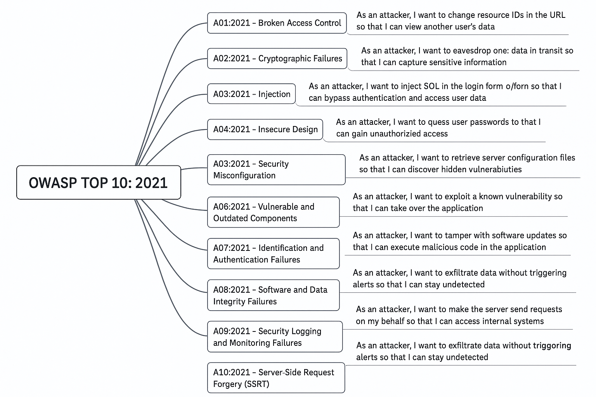

# Simple framework to integrate threat modeling into Agile
AKA a ethnographic approach to security development
## Note
The framework has been generated with the help of ChatGPT

## Why
Bringing threat modeling into Agile using attacker-based user stories can make security risks more visible and manageable during development
## How
You're essentially flipping traditional user stories to write abuser stories or threat stories, which describe how an attacker might exploit weaknesses. These stories can then be addressed like any other backlog item.

## Follows a framework we can use
#### 🧠 Structure of an Attacker Story

    As an attacker, I want to [action/technique] so that I can [impact].

Example:

    As an attacker, I want to inject SQL code in the login form so that I can bypass authentication and access user accounts.

#### 🔄 How to Integrate into Agile

- Add to the Product Backlog -> Include threat stories alongside user stories.
- Link to User Stories\Features -> Every user story (e.g., "As a user, I want to log in") should be evaluated for potential threat stories.
- Define Acceptance Criteria for Threat Mitigation: Add security controls as criteria
  - Input validation is enforced
  - Parameterized queries are used.
- Use STRIDE or CAPEC to Guide Threat Discovery. Generally we use STRIDE to help identify what type of threats to consider.
- Sprint Planning & Refinement -> Discuss threat stories during refinement.
- Prioritize critical threats using a qualitative risk management approach

### 🔧 Sample Attacker Story Template

    Title: SQL Injection in Login
    
    **As** a malicious user  
    **I want to** inject SQL code in the login form  
    **So that I can** bypass authentication and access restricted data
    
    **Related user story**: As a user, I want to log in with my email and password.
    
    **Acceptance criteria**:
    - Input validation is enforced
    - Prepared statements are used
    - Login failures are logged and rate-limited

You can find more user's stories [here](samples_mal_us.md)

## Sample OWASP 10 (2021) Malicious User Stories

## Create a threat catalog
Follows an example of a catalog used to prioritize threats 

| **ID** | **Threat Title**                      | **Attacker Story**                                                                 | **STRIDE**                 | **Severity** | **Mitigations / Controls**                                                     | **Detection Methods**                                | **Owner / Champion**      | **Sprint Priority** |
|--------|----------------------------------------|-------------------------------------------------------------------------------------|----------------------------|--------------|----------------------------------------------------------------------------------|------------------------------------------------------|---------------------------|----------------------|
| T001   | SQL Injection                          | As an attacker, I want to inject SQL into a form so I can bypass login              | Tampering, EoP             | High         | Input validation, parameterized queries, WAF                                     | WAF alerts, query logs, SIEM                          | Security Champion Dev Team | High                 |
| T002   | Privilege Escalation                   | As an attacker, I want to escalate my role to admin through insecure API calls      | EoP, Spoofing              | High         | RBAC enforcement, privilege boundaries                                           | Audit logs, API gateway monitoring                    | Lead Developer             | High                 |
| T003   | Session Hijacking (XSS)                | As an attacker, I want to inject JS to steal cookies and impersonate users          | Tampering, Info Disclosure | High         | CSP, output encoding, HTTPOnly cookies                                           | CSP violation reports, user-agent anomaly detection   | Frontend Dev               | High                 |
| T004   | Insecure File Upload                   | As an attacker, I want to upload malicious scripts to execute server-side code      | Tampering, EoP             | Medium       | File validation, sandboxed upload directory, antivirus scanning                 | File scanning logs, app error reports                 | DevOps                     | Medium               |
| T005   | Brute Force Login                      | As an attacker, I want to try many passwords to break into accounts                 | Spoofing, DoS              | Medium       | Rate limiting, CAPTCHA, MFA                                                     | Auth logs, failed login alerts                        | Backend Dev                | Medium               |
| T006   | Outdated Dependencies (RCE)            | As an attacker, I want to exploit a known vuln in a 3rd-party library               | Tampering, EoP             | High         | SBOM, dependency scanning, patch management                                     | SCA tools (e.g., Snyk, Dependabot), build pipeline    | Security Team              | High                 |
| T007   | SSRF to Internal Admin Panel           | As an attacker, I want the server to make requests to an internal IP                | Spoofing, Info Disclosure  | High         | URL allow-listing, block internal metadata IP ranges                            | Outbound request monitoring, DNS logging              | Infra Team                 | High                 |
| T008   | Log Poisoning / WAF Bypass             | As an attacker, I want to obfuscate input to evade detection or logging             | Repudiation                | Medium       | Structured logging, encoding, input validation                                  | Log review automation, alerting on parsing failures   | AppSec                     | Medium               |
| T009   | Insecure Design (Missing Rate Limits)  | As an attacker, I want to overload the system by flooding it with requests          | DoS, Tampering             | Medium       | Functional security design, performance testing                                 | App metrics, rate limit metrics                       | Product Owner              | Medium               |
| T010   | Malicious CI/CD Artifact               | As an attacker, I want to inject malware via an automated build                     | Tampering                  | High         | Signed builds, artifact integrity checks, CI/CD isolation                       | CI audit logs, artifact hash verification             | DevOps Lead                | High                 |
